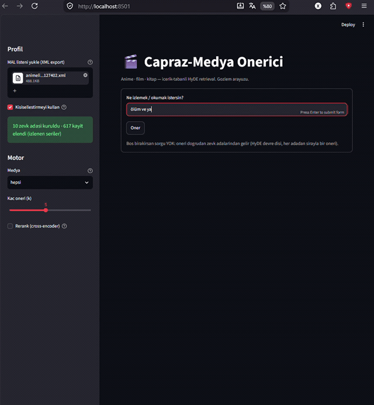
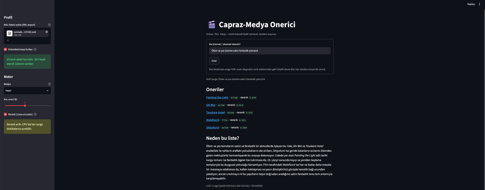
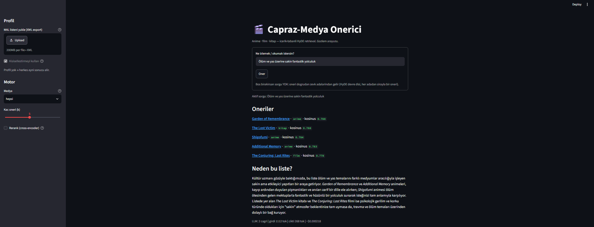

# Çapraz-Medya Önerici

Anime, film ve kitabı **tek bir vektör uzayında** arayan, MAL listenden zevk profili çıkaran
içerik-tabanlı bir öneri sistemi. Framework yok — LangChain/LlamaIndex kullanılmadı; retrieval
hattı, chunking denemeleri, profil çıkarımı ve eval'in tamamı elle yazıldı.

> **Çapraz medya neden ilginç:** collaborative filtering "Monster'ı sevdiysen şu kitap" diyemez —
> o kitabı okuyan anime kullanıcısı yoktur, ortak sinyal yoktur. Embedding diyebilir.

---

## Ekran



*Tek sorgu, kesintisiz: "ölüm ve yas üzerine sakin fantastik yolculuk" → HyDE → retrieval →
sonuç. İlk beşte **anime, film ve kitap bir arada**; altında getirilen metne dayalı gerekçe ve
çağrı/token/maliyet sayacı. Bekleme süresi kırpılmadı, hızlandırılmadı — gerçek süre bu.
Rerank kapalı (CPU'da 1.5-3 dk/sorgu; kazancı ve neden kapalı olduğu aşağıda).*

<details>
<summary>Duran kareler</summary>



*Tam hat: MAL listesi yüklü (10 zevk adası kuruldu, 617 kayıt elendi), rerank açık.
Tek sorgu — "ölüm ve yas üzerine sakin fantastik yolculuk" — sonuçta anime, kitap ve film
bir arada. Altta çağrı/token/maliyet sayacı.*



*Aynı sorgu, çıplak hat: profil yok, rerank yok. Kişiselleştirmesiz herkes aynı sonucu alır.*

</details>

> İki kare aynı sorguda farklı listeler veriyor ve gözle bakınca ikincisi daha isabetli
> duruyor. Bu bir kanıt değil: tek sorgu, tek koşu. `eval.py` 23 sorguda rerank'in
> `recall@5`'e **+0.18** kattığını ölçüyor — ekran görüntüsü ölçüm değildir.

---

## Kurulum

```bash
python -m venv .venv && source .venv/Scripts/activate
```

```bash
pip install -r requirements.txt
```

```bash
cp .env.example .env
```

`.env`'e en az **`GEMINI_API_KEY`** gerekiyor (Google AI Studio, ücretsiz katman) — HyDE sahte
belgesi ve öneri gerekçesi oradan üretiliyor.

### Veri

**Corpus repoda yok** (13 MB, üçüncü taraf verisi). `scripts/` altındaki çekiciler `data/`
klasörünü doldurur; hepsi **resumable** — yarıda kesilirse kaldığı yerden devam eder.

```bash
python scripts/cek_anilist.py && python scripts/cek_anilist_relations.py && python scripts/cek_mal_synopsis.py
```

```bash
python scripts/cek_tmdb.py && python scripts/cek_books.py
```

Film/kitap çekicileri `TMDB_API_KEY` ve `GOOGLE_BOOKS_API_KEY`, MAL sinopsis çekicisi
`MAL_CLIENT_ID` ister. Rate limit'e nazik davranıyorlar; ilk tam çekim saatler sürer —
**bir kez koşulur, sonuç dondurulur.**

İlk açılışta 12104 kayıt gömülür (CPU'da birkaç dakika) ve `cache/*.npy` olarak saklanır;
sonraki açılışlar onu okur.

> `cache/hyde/` **bilerek repoda**: 47 dondurulmuş sahte belge. `eval.py`'nin tekrarlanabilir
> olması buna bağlı — ölçüm dondurulur, ürün rastgele kalır.

### Demo modu — veri çekmeden çalıştırma

`demo/` klasörü **önceden hesaplanmış vektörleri** (7807×1024, float16 — paket 2026-09-06'da,
kitap kaynağı Open Library'ye taşınmadan önceki corpus'tan üretildi) ve
telifsiz meta bilgiyi (başlık, id, tür) taşıyor. **Sinopsis metni bu pakette yok** — üçüncü
tarafa ait. Sonuçlar gerçek sistemle aynı, çünkü vektörler aynı.

```bash
DEMO_MODU=1 streamlit run app.py
```

`data/` boşsa demo modu **kendiliğinden** açılır. Paketi yeniden üretmek için (tam corpus
gerekir): `python demo_hazirla.py`

> **Provenance neden önemli:** `_index()` normalde cache dosya adına belgelerin içerik
> hash'ini yazıyor — metin değişince eski vektörler sessizce okunamasın diye. Demo modunda
> belge metni yok, dolayısıyla o guard uygulanamıyor; **bypass edilmedi, yerine
> `demo/provenance.json` kondu** (model, kaynak belge hash'i, kayıt sayısı, üretim tarihi).
> `_demo_index()` satır hizasını ve model adını yükleme anında doğruluyor.

## Çalıştırma

```bash
streamlit run app.py
```

Sol panelden MAL XML export'unu yükle (MyAnimeList → Profile → Export). Yüklemezsen sistem
kişiselleştirmesiz çalışır. Sorgu kutusunu **boş bırakırsan** sorgusuz moda geçer: öneriler
doğrudan zevk adalarından gelir.

Ölçüm:

```bash
python eval.py
```

```bash
python holdout.py
```

`eval.py` retrieval'ı ölçer (recall@k + MRR, 23 sorguluk altın set); `holdout.py` öneri
kalitesini ölçer (tut-bırak, rastgele tabanlı).

---

## Mimari

```
sorgu ──▶ HyDE ──▶ pusula ──▶ [profil harmanı] ──▶ bi-encoder ──▶ 50 aday ──▶ [rerank]
                                                                                  │
                                          seri tekilleştirme + medya kotası ◀──────┘
                                                          │
                                                          ▼
                                                   k öneri + LLM gerekçesi

sorgu YOKSA ──▶ zevk adaları ──▶ adalar arası round-robin ──▶ k öneri
```

| dosya | işi |
|---|---|
| `config.py` | tüm eşikler ve model adları; her flag'in yanında **ölçüm gerekçesi** |
| `veri.py` | dondurulmuş corpus yükleme, `belge()` = gömülecek tek string |
| `llm.py` | LLM sarmalayıcı (Gemini), 5xx retry, token/maliyet sayacı |
| `retrieval.py` | HyDE, arama, maskeler, rerank, seçim; `profil_kur`, `getir`, `getir_profilden` |
| `profil.py` | XML → zevk profili: çekirdek, K-means adaları, harman, franchise maskesi, kota |
| `oneri.py` | getirilen metne dayalı gerekçe üretimi (iki ayrı prompt: sorgulu / sorgusuz) |
| `eval.py` | altın set, `recall@k`, `MRR`, işaret testi, sorgu-bazlı karşılaştırma |
| `holdout.py` | "iyi öneri" ölçütü — tut-bırak |
| `app.py` | Streamlit arayüzü |
| `scripts/cek_*.py` | corpus çekme (bir kez koşulur, sonuç dondurulur) |
| `deney_a11*.py` | HyDE çıpası deneyi — kanıtı zayıf çıktı, `HYDE_CIPA=0.0` kaldı |

**Modeller:** `intfloat/multilingual-e5-large` (bi-encoder), `BAAI/bge-reranker-v2-m3`
(cross-encoder, varsayılan kapalı), Gemini flash-lite (HyDE sahte belgesi + gerekçe metni).

**Corpus dondurulmuş: 12104 kayıt** — 4880 anime (AniList metadata + MAL sinopsis), 2430 film
(TMDB), 4794 kitap (Open Library eser kayıtları; 2026-09-10'a kadar 497 kayıtlık Google Books
corpus'uydu). Canlı API'den beslenen bir eval, ölçtüğü şeyi değiştirir:
`recall@5` düştüğünde suçlu senin kodun mu yoksa TMDB'nin güncellediği bir özet mi, bilemezsin.

---

## Ölçüm

Altın set 23 sorgu (18 anime + 5 film), franchise düzeyinde eşleşme.
**Gürültü tabanı ±0.043** — 23 sorguda tek bir sorgunun yer değiştirmesi bu kadar oynatıyor,
bunun altındaki hiçbir fark okunmaz.

### Retrieval hattının gelişimi

| aşama | recall@5 | ne değişti |
|---|---|---|
| HyDE'siz (ham Türkçe sorgu) | **0.000** | — |
| HyDE (AniList sinopsisi) | 0.261 | sistem |
| HyDE (MAL sinopsisi) | 0.435 | sistem — **gerçek kazanç** |
| + medya kotası + seri tekilleştirme | 0.435 | ürün değişti, metrik sabit |
| franchise düzeyinde eşleşme | 0.565 | ⚠️ **ölçü düzeldi — KAZANÇ DEĞİL** |
| kitap corpus'u 497 → 4794 (Open Library) | **0.478** | corpus büyüdü — **REGRESYON DEĞİL** |

Son iki satır bilerek işaretli, ikisi de aynı sebepten: **sayı oynadı ama sistem
değişmedi.**

Franchise satırı: ürün franchise başına tek temsilci döndürüyor ve hangisinin hayatta
kalacağına 0.001'lik skor farkı karar veriyor; katı eşleştirici bunu sistematik
yanlış-negatif sayıyordu. Sayının büyümesi sistemin iyileşmesi değil, ölçünün dürüstleşmesi.

Corpus satırı: aynı 23 altın hedef artık 7224 fazla belgeyle yarışıyor (7807 → 12104).
Havuz zorlaştı, retrieval aynı kaldı. Bu yüzden `recall@50` **hiç oynamadı** (0.739) —
tavan corpus'un büyümesinden etkilenmiyor, ilk-5 yarışı etkileniyor.

**Ürün konfigü** (12104 kayıt, 2026-09-11, donmuş HyDE, rerank kapalı):

| ölçü | değer | ne söylüyor |
|---|---|---|
| `recall@50` | **0.739** | HAVUZ kalitesi — kaba süzgeç gold'u bulabiliyor mu |
| `recall@5` | **0.478** | k=50 listesinin ilk 5'i |
| `MRR` | **0.326** | gold'un ortalama sıra tersi |
| `isabet@5` | **0.478** | **ÜRÜNÜN verdiği liste** — `getir(k=5)` çağrısından, 11/23 sorgu |
| `isabet@10` | **0.522** | aynı, `getir(k=10)` — 12/23 sorgu |

Son iki satır neden ayrı: kota `k` ile ölçekleniyor (`k=50` → 30/10/10, `k=5` → 3/1/1),
yani k=50 listesinin ilk 5'i ürünün döndürdüğü liste **değil**. `recall@k` havuzu ölçer,
`isabet@k` kullanıcının gördüğünü. Ayrımı ölçü aracına eklemek bir gün sürdü; o güne kadar
eval kendi ürününü ölçtüğünü sanıyordu.

> ⚠️ **Bu belgedeki diğer sayılar 7807 kayıtlık corpus'ta ölçüldü** (rerank +0.18, çıpa
> 0.652, tablodaki ara aşamalar). A/B *farkları* geçerli — hepsi tek değişkenle, donmuş
> HyDE ile koşuldu — ama mutlak değerler yukarıdaki tabanla kıyaslanamaz. Eski corpus'ta
> `recall@5` tabanı 0.565'ti.

### Öneri kalitesi (tut-bırak)

`recall@k` retrieval'ı ölçüyor, öneri kalitesini değil — kişiselleştirme tanımı gereği altın
setin hedefinden uzaklaştırır, dolayısıyla `recall@k` ile ayarlanamaz. Ayrı bir ölçü gerekiyordu:
**10 verdiğim franchise'lardan 8'ini profilden gizle, sistem geri buluyor mu?** (5 tekrar, farklı
gizlenen kümeleriyle, tohum sabit.)

> **Ad çakışması, dikkat:** aşağıdaki `isabet@k` yukarıdakiyle **aynı şey değil.**
> Yukarıdaki (`eval.py`) "gold ürünün k'lık listesinde mi" diye soruyor; aşağıdaki
> (`holdout.py`) "profilden gizlediğim franchise'ı sistem geri buluyor mu" diye soruyor.
> Farklı ölçü, farklı taban, farklı soru.

| k | isabet@k (tut-bırak) | rastgele | kat |
|---|---|---|---|
| 5 | 0.000 | 0.0023 | 0x |
| 10 | 0.000 | 0.0046 | 0x |
| 20 | 0.050 | 0.0092 | **5.4x** |
| 50 | 0.125 | 0.0230 | **5.4x** |

Rastgele taban olmadan `hit@50 = 0.125` hiçbir şey söylemez; rastgele bir sistemin ne
bulacağını bilmeden "iyi" denemez. Rapor edilen sayı bu yüzden **kat**.

Taban **franchise havuzu** üzerinden hesaplanıyor, kayıt havuzu üzerinden değil: ürün
franchise başına tek temsilci döndürüyor ve eşleşme franchise düzeyinde, o hâlde şans da
öyle olmalı. 4880 anime kaydı ≈ 2170 franchise; kayıt üzerinden hesaplayan ilk sürüm şansı
yarıya düşürüp katı **11.3x** diye iki katına şişirmişti. Ölçünün her adımı — gizleme,
eşleştirme, taban — aynı semantiği taşımalı; üçünden biri kaçınca sayı yanlış çıkıyor.

**Kişiselleştirme çalışıyor ama zayıf.** Rastgelenin 5 katı — no-op değil. Ama `hit@5` = 0:
listenin tepesinde 10 vereceğim bir şey çıkmıyor.

---

## Tasarım kararları

**Profil tek ortalama değil, K-means "zevk adaları" (K=10).** Tek ortalama profille top-12 skor
bandı **0.0068**'e çöküyordu; 130 vektörün ortalaması corpus'un ağırlık merkezine yaklaşıyor ve
merkeze uzaklık 4880 kayıt için kabaca aynı olduğundan sıralamada ayırt edecek bir şey kalmıyor.
Adalarla bant medyanı **0.0322** (5x), en iyi adada 0.0965 (14x). Genel kural: *ortalanan şeyler
birbirine yakınsa kazanç (gürültü söner), uzaksa kayıp (sinyal söner).*

**Profil "çeker" değil, "ince ayar yapar" — ama bu ağırlığa bağlı.** Ada seçimi LLM işi değil,
`argmax(merkezler @ pusula)` zaten uzayda bir mesafe sorusu; LLM'in meşru rolü adaları
*isimlendirmek*, seçmek değil. Harmanın ağırlığı ise `izle.py` ile yan yana koşularak seçildi:

| `profil_agirligi` | pusulanın oynadığı açı | ilk 5'in medyası | 1. sıra |
|---|---|---|---|
| 0.0 | 0° | anime + kitap + film | Garden of Remembrance |
| **0.2** | **6.8°** | anime ×3 + kitap + film | **Garden of Remembrance** |
| 0.3 | 10.4° | anime ×4 + kitap | Shin no Nakama… |
| 0.6 | 21.2° | anime ×5 | *(doğru tepe listeden düştü)* |

Varsayılan **0.2**. 0.6'da pusula sorguyu terk ediyor: "ölüm ve yas üzerine sakin fantastik
yolculuk" sorgusunda maskesiz tepe KonoSuba (komedi isekai) oluyor ve birebir yas temalı olan
sonuç listeden tamamen düşüyor. 0.2 hem çapraz medyayı kota zorlamasına gerek kalmadan
koruyor hem de doğru tepeyi. *(Kanıt gözle bakma, ölçüm değil — ama 0.6'nın arkasında da
ölçüm yoktu: `eval` kişiselleştirme kapalı koşar, `holdout` sorgusuz yolu ölçer, dolayısıyla
"sorgu + profil" yolu ölçünün dışında kalmıştı.)*

**Medya dengesi bir ürün kararıdır, vektörün insafına bırakılmaz.** Profil ağırlığı 0.3'e
çıktığında sonuçların %97'si anime oluyordu (0.6'da %100). Sebep yapısal: profil anime verisinden
kuruldu, adalar uzayın anime bölgesinde. Çözüm sabit kota (3/1/1, k'ya orantılı ölçekleniyor).
Kota bir **tavan**, kendi başına slot doldurmaz — sorgusuz yolda havuz kırpılınca kota
dolmuyordu, havuz tüm corpus'a açıldı.

**Aday filtresi kırpmadan ÖNCE.** İzlenen seriler ve medya maskesi `argsort`'tan sonra
uygulanırsa elenen kayıtlar yerlerini çoktan doldurmuş olur.

**Seri filtresi `idMal` değil, franchise grafı.** AniList `relations` ile bağlı bileşenler;
`CHARACTER` ve `OTHER` kenarları hariç — geçişlilik yüzünden gevşek bir kenar tipi corpus'un
yarısını tek franchise yapabilir. Sağlaması: en büyük grup 92 kayıt (%1.9), patlama yok.
Naif `idMal` filtresi 321 kayıt eliyordu, franchise filtresi **617**.

**İçeriksiz sorgu HyDE'a verilmez.** *"Bana listeme göre öner"* sorgusunun içeriği sıfır;
HyDE yoktan bir olay örgüsü uyduruyordu (*"former rivals... catastrophic timeline collapse
across parallel dimensions"*) ve hat o uydurmayı arıyordu. İçerik sorguda değil **listede**.
Sorgusuz yol adalar arası round-robin ile çalışır: *tek ortalama ayrımı öldürür, tek ada
çeşitliliği öldürür.*

**Profil süreçte değil, oturumda.** Modül-düzeyi bir global sabit bir XML yolundan okuyordu:
Streamlit tek süreçte döndüğü için demoyu açan herkes aynı kişinin zevkini alıyordu ve bunu
hiçbir hata göstermiyordu. İndeks sürece aittir (ağır, paylaşımlı, kullanıcıdan bağımsız),
profil oturuma. `getir(kisisel: bool)` yerine `getir(profil_paketi=...)`: bayrak yok, gizli
varsayılan dosya yok — profil ya verilir ya verilmez.

---

## Kanıtlı reddetmeler

Bir teknik, ancak çözdüğü problem gerçekten varsa işe yarar. Aşağıdakiler denendi, ölçüldü ve
**bilinçli olarak kullanılmadı** — repoda durmamaları bir eksiklik değil, bir sonuç.

| teknik | neden reddedildi |
|---|---|
| **Chunking** | Sinopsisler 150-200 kelime, tek chunk'a sığıyor; bölünecek doküman yok. Nutuk üzerinde öğrenildi ve ölçüldü, sonra kullanılmadı. |
| **FAISS / ANN** | 7807 kayıtta brute-force matmul zaten milisaniye. ANN yaklaşıklığı karşılıksız doğruluk kaybı olurdu. |
| **Üçüncü kademe reranker (ColBERT vb.)** | 1M belgeli sistemlerin çözümü; corpus 7807. Teşhis edilmemiş soruna tedavi. |
| **Rerank (varsayılan)** | `recall@5`'e **+0.18** — ölçülmüş, gerçek, büyük. Ama CPU'da dakika/sorgu. Varsayılan kapalı, arayüzden açılabilir. *Kanıt güçlü, maliyet kabul edilemez.* |
| **HyDE çıpası (varsayılan)** | Tersi vaka. `cipa=0.25` `recall@5`'i 0.652'ye çıkardı ama bu 23 sorguda 2 sorgu ve tek koşu. *Maliyet ~sıfır, kanıt zayıf.* Kod hazır (`--cipa`), varsayılan 0.0. |
| **`hyde_n=5`** | Beş sahte belgeyi ortalamak kazandırmadı. Bağımsız çekilişler birbirinden uzaksa ortalama net bir temayı değil, bulanık bir uzlaşmayı üretiyor. |

İki karar da tek bir çerçeveden çıkıyor: **kanıtın gücü ile maliyetin büyüklüğü ayrı eksenler.**
Rerank güçlü kanıt + kabul edilemez maliyet, çıpa zayıf kanıt + ihmal edilebilir maliyet.

---

## Ölçü hakkında öğrendiklerim

Bu projenin en pahalı dersleri modelde değil, **ölçü aletinde** çıktı. Hiçbiri hata vermedi;
hepsi yanlış söyledi.

- **`_index` cache'i** yalnızca kayıt sayısını kontrol ediyordu. Metin değişip sayı sabit
  kalınca eski vektörler sessizce okunuyordu → cache adı artık içerik hash'i taşıyor.
- **`eval.py --kaynak`** varsayılanı `config.py`'yi her koşuda sessizce eziyordu; bir
  karşılaştırma farkında olmadan iki değişkenli koştu.
- **`recall@k` eşiklidir.** `cipa=0.05`'te beş sorgu iyileşti, hiçbiri kötüleşmedi ve metrik
  **0.000** yazdı — çünkü hiçbiri 5. sıra çizgisini geçmedi. *Eşiği geçmeyen gerçek bir
  iyileşme sıfır olarak raporlanır.* Sorgu bazlı karşılaştırma bu yüzden `eval.py`'de.
- **İşaret testi 23 sorguda güçsüz.** n harekette ulaşılabilecek en küçük iki yönlü p = 2/2ⁿ;
  5 harekette 0.0625, yani kusursuz bir 5/0 sonucu bile 0.05'i geçemez. *Bir ölçüyü seçerken
  neyi ölçtüğü kadar, eldeki örneklem büyüklüğünde bir şey söyleyebilecek gücü de hesaba
  katılır.*
- **Tut-bırak ölçüsü ilk sürümde ölçtüğü şeyi imkânsız kılıyordu.** Tek tek başlık gizleniyordu
  ama maske franchise düzeyinde çalışıyor: gizlenen 20 kaydın yalnızca 7'si ulaşılabilirdi ve
  sonuç sert 0 çıkıyordu. *Ölçünün her adımı ürünle aynı semantiği taşımalı.*
- **Aynı adı taşıyan iki farklı ölçek.** Rerank açıkken `_skor` cross-encoder skoru (0.0X
  bandı), kapalıyken kosinüs (0.9 bandı). Arayüz ikisini "skor" diye gösterince dışarıdan bakan
  biri sistemi bozuk sandı. Artık ölçeğin adı yazılıyor.

---

## Bilinen eksikler

- **Tavan 0.739.** Altın setin ~%26'sı `recall@50` havuzuna hiç girmiyor. Kaba süzgeç yalnızca
  kaybedebilir — hiçbir reranker, çıpa ya da üçüncü kademe bunu kurtaramaz. Sorun sıralamada
  değil, gömmede.
- **`hit@5` = 0.** Kişiselleştirme rastgelenin 5,4 katı ama listenin tepesini tutturamıyor.
- **Çapraz medya hiç ölçülmedi.** Projenin ayırt edici özelliği için altın set yok.
- **Kitap corpus'u zayıf:** 497 kayıt, fantastik/çocuk klasiklerine sıkışmış. "Monster gibi
  kitap" iddiası bu corpus'la desteklenmiyor.
- **Negatif sinyal kullanılmıyor.** Düşük puanlar ve bırakılanlar yalnızca aday filtresi;
  ceza ağırlığı olarak değerlendirilmiyor.
- **Gerekçe profili görmüyor.** Açıklama getirilen metne dayanıyor (grounding var) ama
  "Frieren'e 10 verdiğin için" diyemiyor — profil prompt'a girmiyor.
- **Franchise grafı anime'ye özel.** Film ve kitapta seri farkındalığı yok; bir serinin 4.
  kitabı tek başına önerilebiliyor.
- **Film/kitap profili yok.** Letterboxd/Goodreads export mevcut değil; mimari hazır.

---

## Nereden çıktı

Bu proje bir öğrenme yol haritasının (Faz 4 — RAG) çıktısı olarak yazıldı ve
[`yol-haritasi`](https://github.com/DenizSeno1/yol-haritasi) deposundan buraya taşındı;
commit geçmişi korundu.

Framework kullanılmamasının sebebi tercih değil **kural**: o yol haritasında bir katman,
altındaki kavram elle yazılmadan kütüphaneye devredilmiyor. Embedding ve attention Faz 2'de
elle yazıldığı için burada `sentence-transformers` kullanmak serbestti; retrieval hattı,
profil çıkarımı, chunking denemeleri ve eval elle yazıldı.

Yazılış sırası da bilinçli: **önce ölçü, sonra özellik.** Yukarıdaki tabloların çoğu bir
özelliğin eklenme gerekçesi değil, eklenmeme gerekçesi.
